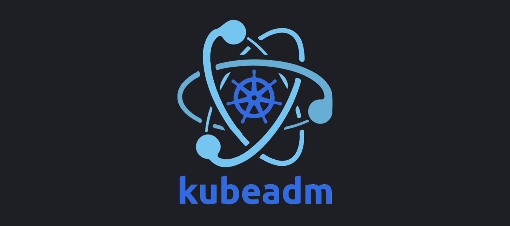
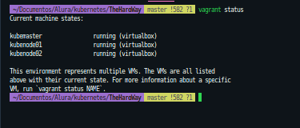
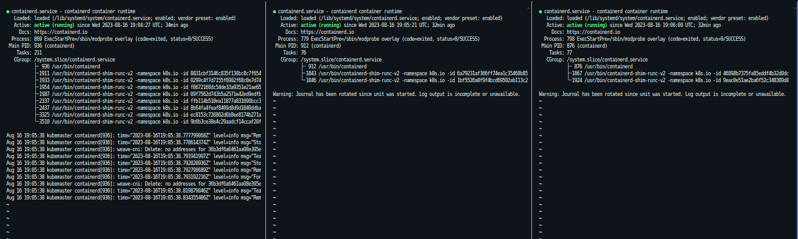
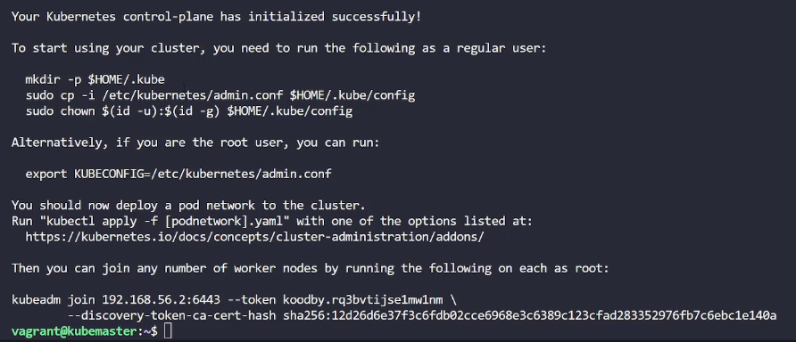
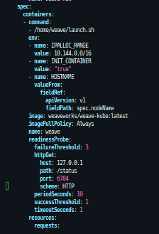
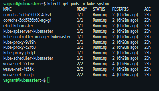
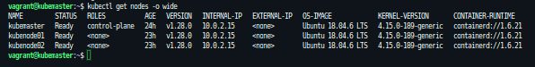

<p>
  
</p>

<br/>

<h1>Deploy kubernetes cluster com kubeadm</h1>
<h1>The Hardest Way</h1>

<h2> 1 - Preparando o ambiente</h2>

<h3>VirtualBox</h3>

Instalação:

https://www.virtualbox.org/wiki/Linux_Downloads

<h3>Vagrant para provisionamento das VMs</h3>

Para criação do ambiente será utilizado o vagrant para provisionamento de um cluster com 3 nodes(1 master e 2 workers) cada um com 2G de memoria e 2 CPUs

Instalação:

https://developer.hashicorp.com/vagrant/tutorials/getting-started/getting-started-install

<h4>Criando as maquinas virtuais:</h4>

No diretorio onde se encontra o arquivo Vagrantfile executar o seguinte comando:

`vagrant up`

Verificando status

`vagrant status`

<p>
  
</p>

Acessando os nodes:

`vagrant ssh nodename`

<h2> 2 - Instalação do Kubeadm</h2>

Executar os proximos procedimentos em todos os nós

Documentação: https://kubernetes.io/docs/setup/production-environment/tools/kubeadm/install-kubeadm/

<h3>Container runtime containerd</h3>

Documentação: https://kubernetes.io/docs/setup/production-environment/container-runtimes/

<h4>Pré requisitos</h4>

```
cat <<EOF | sudo tee /etc/modules-load.d/k8s.conf
overlay
br_netfilter
EOF

sudo modprobe overlay
sudo modprobe br_netfilter

# sysctl params required by setup, params persist across reboots
cat <<EOF | sudo tee /etc/sysctl.d/k8s.conf
net.bridge.bridge-nf-call-iptables  = 1
net.bridge.bridge-nf-call-ip6tables = 1
net.ipv4.ip_forward                 = 1
EOF

# Apply sysctl params without reboot
sudo sysctl --system


```

Verificar se o br_netfilter, overlay modules foi carregado executando os seguintes comandos:

```
lsmod | grep br_netfilter
lsmod | grep overlay
```

Verificar se net.bridge.bridge-nf-call-iptables, net.bridge.bridge-nf-call-ip6tables, and net.ipv4.ip_forward variaveis de sistema possuem valor 1 no sysctl config:

```
sysctl net.bridge.bridge-nf-call-iptables net.bridge.bridge-nf-call-ip6tables net.ipv4.ip_forward
```

<h4>Instalação</h4>

Documentação: https://github.com/containerd/containerd/blob/main/docs/getting-started.md#option-2-from-apt-get-or-dnf

Atualizar apt e instalar seguintes pacotes:

```
sudo apt-get update
sudo apt-get install ca-certificates curl gnupg

```

Adicionar Docker’s official GPG chave:

```
 sudo install -m 0755 -d /etc/apt/keyrings

 curl -fsSL https://download.docker.com/linux/ubuntu/gpg | sudo gpg --dearmor -o /etc/apt/keyrings/docker.gpg

 sudo chmod a+r /etc/apt/keyrings/docker.gpg
```

Setando repositorio:

```
echo \
  "deb [arch="$(dpkg --print-architecture)" signed-by=/etc/apt/keyrings/docker.gpg] https://download.docker.com/linux/ubuntu \
  "$(. /etc/os-release && echo "$VERSION_CODENAME")" stable" | \
  sudo tee /etc/apt/sources.list.d/docker.list > /dev/null
```

Update the apt package index:

`sudo apt-get update`

Instalar containerd

`sudo apt-get install containerd``

Reiniciando containerd

`
systemctl start containerd`

Verificando status do containerd

`systemctl status containerd`

<p>
  
</p>

<br/>

<h4>Cgroup drivers</h4>

Documentação: https://kubernetes.io/docs/setup/production-environment/container-runtimes/#cgroup-drivers

Se o sistema utilizar systemd init system escolher systemd
cgroupfs é o padrão

Verificar init system:

`ps -p 1`

Para systemd

Editar o arquivo config.toml apagar todo o conteudo e inserir as informações abaixo

`vi /etc/containerd/config.toml`

```
#   Copyright 2018-2022 Docker Inc.

#   Licensed under the Apache License, Version 2.0 (the "License");
#   you may not use this file except in compliance with the License.
#   You may obtain a copy of the License at

#       http://www.apache.org/licenses/LICENSE-2.0

#   Unless required by applicable law or agreed to in writing, software
#   distributed under the License is distributed on an "AS IS" BASIS,
#   WITHOUT WARRANTIES OR CONDITIONS OF ANY KIND, either express or implied.
#   See the License for the specific language governing permissions and
#   limitations under the License.

[plugins."io.containerd.grpc.v1.cri".containerd.runtimes.runc]
  [plugins."io.containerd.grpc.v1.cri".containerd.runtimes.runc.options]
    SystemdCgroup = true
```

Aplicando as configurações:

`sudo systemctl restart containerd`

<h2>3 - Instalando kubeadm,kubelet e kubectl</h2>

Update the apt package index and install packages needed to use the Kubernetes apt repository:

```
sudo apt-get update
# apt-transport-https may be a dummy package; if so, you can skip that package
sudo apt-get install -y apt-transport-https ca-certificates curl

```

Download the public signing key for the Kubernetes package repositories. The same signing key is used for all repositories so you can disregard the version in the URL:

`curl -fsSL https://pkgs.k8s.io/core:/stable:/v1.28/deb/Release.key | sudo gpg --dearmor -o /etc/apt/keyrings/kubernetes-apt-keyring.gpg`

Add the appropriate Kubernetes apt repository:

```
# This overwrites any existing configuration in /etc/apt/sources.list.d/kubernetes.list
echo 'deb [signed-by=/etc/apt/keyrings/kubernetes-apt-keyring.gpg] https://pkgs.k8s.io/core:/stable:/v1.28/deb/ /' | sudo tee /etc/apt/sources.list.d/kubernetes.list


```

Update the apt package index, install kubelet, kubeadm and kubectl, and pin their version:

```
sudo apt-get update
sudo apt-get install -y kubelet kubeadm kubectl
sudo apt-mark hold kubelet kubeadm kubectl

```

<h4>Criando um cluster com kubeadm</h4>

Documentação: https://kubernetes.io/docs/setup/production-environment/tools/kubeadm/create-cluster-kubeadm/

<b>As etapas a seguir devem ser aplicadas somente no control-plane node</b>

Inicializando o nó control-plane

`sudo kubeadm init --pod-network-cidr=10.244.0.0/16 --apiserver-advertise-address=192.168.56.2 `

Ocorrendo sucesso na instalação copiar o comando kubeadm join para iniciar os worker nodes

<p>
  
</p>

<br/>

Para exibir novamente o token:

`kubeadm token list`

Por padrão tokens expiram em 24 horas, caso aconteça será necessario criar um novo com o comando:

`kubeadm create token --print-join-command`

Para começar a utilizar o cluster é necessario realizar os seguintes passos:

```

mkdir -p $HOME/.kube
sudo cp -i /etc/kubernetes/admin.conf $HOME/.kube/config
sudo chown $(id -u):$(id -g) $HOME/.kube/config

```

<h3>Pod Network add-on</h3>

Os plugins mais utilizados são Weave Net, Calico, Flannel e neste exemplo usaremos o Weave

Documentação: https://kubernetes.io/docs/concepts/cluster-administration/addons/

<h4>Instalação Weave Net add-on</h4>

Documentação: https://www.weave.works/docs/net/latest/kubernetes/kube-addon/

`kubectl apply -f https://github.com/weaveworks/weave/releases/download/v2.8.1/weave-daemonset-k8s.yaml`

Editar daemonset weave-net incluindo a variavel de ambiente IPALLOC_RANGE com o cidr range

`kubectl edit ds weave-net -n kube-system`

```

env:
#CIDR block

- name: IPALLOC_RANGE
  value: 10.144.0.0/16

```

<p>
  
</p>

Verificando se os pods do kubernetes estão em execuação:

`kubectl get pods -n kube-system`

<p>
  
</p>

<h3>Inicializando os worker nodes</h3>

Executar o seguinte comando nos worker nodes:

```

kubeadm join 192.168.56.2:6443 --token wfyc1e.jt3fgdqtr75d0g6y --discovery-token-ca-cert-hash sha256:b48d1f3c0f4463470b7aebfa7e33fa93309da3c6cd4a6eb082c75c50d9b8eb86

```

<p>
  
</p>
